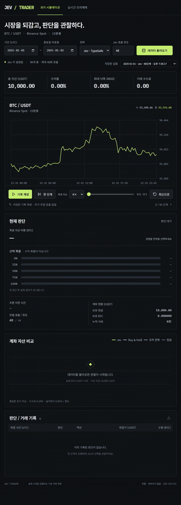
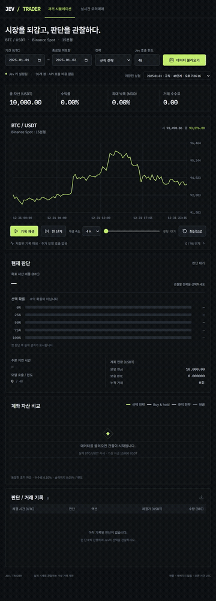

# Jev / Trader

[English](README.md)

**비트코인 시장을 되감고, Jev의 판단을 관찰하세요.**

TypeSafe Jev를 이용한 로컬 비트코인 모의매매 실험실입니다. 실제 BTC/USDT 과거 시세를 재생하며 Jev가 자산 비중을 어떻게 선택하는지 보고, 규칙 전략·매수 후 보유·현금과 비교합니다. 실시간 모의계좌에서는 새 봉이 마감될 때마다 판단을 관찰할 수 있습니다.

에이전트에게 주는 정보가 의사 결정에 어떤 영향을 주는지 탐구하기 위한 프로젝트입니다. 가상 자금으로 실행하며 실제 거래소 주문 기능은 없습니다. 현재 대시보드는 한국어입니다.

## 전략별 데모

| Jev · 실제 API 판단 | 규칙 · 고정 이동평균 전략 |
| --- | --- |
| [](media/jev.mp4) | [](media/rule.mp4) |
| [전체 영상](media/jev.mp4) · [스크린샷](media/jev.png) · [판단 원본](media/jev-run.json) | [전체 영상](media/rule.mp4) · [스크린샷](media/rule.png) · [판단 원본](media/rule-run.json) |

영상은 **실제로 저장된 판단 기록을 재생한 것**입니다. 15분봉 한 단계를 영상 1초로 보여주며 추론 대기 시간은 생략했습니다. Jev 기록 생성에는 API 48회가 사용됐고, 영상 시청과 기록 재생에는 추가 호출이 없습니다. 두 전략 모두 **2025년 1월 1일 00:00–12:00 UTC**의 Binance BTCUSDT 시세, 초기 자금 10,000 USDT, 편도 수수료 0.10%·슬리피지 0.05%, 직전 96봉 워밍업을 사용했습니다. 선택 기간은 하루지만 데모는 처음 48단계에서 멈춥니다.

| 이번 기록의 결과 | Jev | 규칙 |
| --- | ---: | ---: |
| 판단 / 실제 모의 거래 수 | 48 / 3 | 48 / 4 |
| 최종 평가 자산 (USDT) | 9,941.78 | 9,938.72 |
| 수익률 | −0.58% | −0.61% |
| 최대 낙폭 | 0.76% | 0.61% |
| 누적 수수료 (USDT) | 5.02 | 9.99 |

짧은 단일 구간의 시연이며 전략의 수익성을 입증하는 결과가 아닙니다. 평가 자산에는 미청산 BTC가 포함되고, 낙폭은 봉 종가 기준입니다. [촬영 조건과 재현 방법](media/README.md) · [정확한 수치](media/demo-results.json).

## 할 수 있는 실험

- **과거 시뮬레이션:** UTC 날짜를 선택하고 15분봉을 한 단계씩 또는 연속으로 진행합니다.
- **실시간 모의계좌:** 공개 시세를 따라가며 새 봉 마감마다 판단합니다.
- **판단 관찰:** BTC 목표 비중, 선택 확률, 추론 시간, 체결, 비용과 계좌 변화를 확인합니다.
- **동일 조건 비교:** 선택 전략, 12/48봉 이동평균 규칙, 매수 후 보유, 현금을 비교합니다.
- **실험 저장:** 이전 실험 복원, 추가 API 호출 없는 되감기, JSON 내보내기를 지원합니다.

## 로컬 실행

Windows 기준입니다. Git, Python 3.11 이상, Node.js 20.19+ 또는 22.12+, [uv](https://docs.astral.sh/uv/getting-started/installation/)가 필요합니다.

```powershell
git clone https://github.com/chahero/trade-jev.git
cd trade-jev
.\setup.cmd
.\start.cmd
```

[localhost:8765](http://127.0.0.1:8765/)를 열고 사용하는 동안 서버 터미널을 켜 둡니다. 잠금 파일 기준으로 의존성을 설치하고 프런트엔드를 빌드한 뒤 FastAPI로 제공합니다. 서버는 로컬 주소에만 바인딩합니다.

**규칙 전략부터 실행:** 모델 API 키가 필요 없습니다. 캐시가 없는 시세를 받으려면 인터넷 연결이 필요하며, Binance 계정이나 거래소 API 키는 필요 없습니다.

**Jev 활성화:** `.env`가 없다면 `.env.example`을 `.env`로 복사한 뒤 본인의 TypeSafe 키를 설정하고 서버를 재시작합니다. 키는 백엔드에서만 읽습니다. `.env`, 시세 캐시, 실험 DB는 Git에서 제외합니다.

```dotenv
TYPESAFE_API_KEY=your_typesafe_api_key
```

새 Jev 판단은 API 사용량을 소비하며 비용이 발생할 수 있습니다. 기본 호출 한도는 100회, 최대 3,000회이며 실패한 요청도 포함합니다. 금액이 아닌 요청 횟수 제한입니다. 30일 전체 실행에는 2,880개 판단이 필요합니다. 저장된 기록 재생에는 추가 호출이 없습니다.

## 첫 실험

1. **과거 시뮬레이션**에서 UTC 날짜와 **규칙 전략**을 선택하고 **데이터 불러오기**를 누릅니다. 종료일은 포함하지 않습니다.
2. **한 단계** 또는 **재생**으로 진행합니다. 매 단계 판단하지만 매번 거래하는 것은 아닙니다.
3. **Jev · TypeSafe**와 작은 호출 한도로 새 실험을 만들어 선택을 비교합니다.
4. **기록 되감기**나 슬라이더로 저장된 판단을 확인합니다. **최신으로**를 누르면 새 판단을 이어갈 수 있는 상태로 돌아옵니다.
5. **저장된 실험**으로 이전 계좌를 열거나 다운로드 버튼으로 JSON을 내보냅니다.

실시간은 **실시간 모의매매 → 모의계좌 만들기 → 실시간 연결** 순서입니다. 한 번에 하나의 계좌만 실행하며, 서버가 켜져 있으면 브라우저를 닫아도 계속합니다. 서버를 재시작하면 정지합니다. 네트워크/API 오류가 발생하면 정지하고 오류를 표시하며, Jev 실패를 규칙 판단으로 대체하지 않습니다.

## Jev가 받는 정보와 행동

요청에는 그 시점까지 마감된 **최근 96개 15분봉 OHLCV**, 현재 모의계좌, 거래 비용 조건을 담습니다. 지침은 현물 계좌에서 수익·낙폭·비용을 함께 고려하도록 합니다. Jev는 **BTC 목표 비중 0/25/50/75/100%** 중 하나를 선택하고, 계좌 엔진이 리밸런싱 필요 여부와 수량을 계산합니다.

현재 뉴스, 호가창, 별도의 기술 지표 묶음은 입력하지 않습니다. 관찰 기간, 추가 정보, 판단 지침을 바꾸면 실험 조건도 달라집니다. 실제 요청은 [server/policy.py](server/policy.py)에서 확인할 수 있습니다.

선택 확률은 모델이 각 비중을 선택할 확률이며 **수익 확률이 아닙니다**. API가 매매 이유를 제공하지 않으므로 앱에서 임의로 생성하지 않습니다.

## 체결과 데이터

| | 과거 시뮬레이션 | 실시간 모의매매 |
| --- | --- | --- |
| 판단 입력 | 다음 체결 봉 이전에 마감된 봉 | 최신 마감 봉과 최근 기록 |
| 모의 체결 | 다음 봉 시가 ± 슬리피지 | 추론 응답 이후 받은 현재가 ± 슬리피지 |
| 진행 | 브라우저에서 순차적으로 단계 요청 | 서버가 5초 간격 조회, 새 15분봉마다 한 번 판단 |
| 놓친 시간 | 한 봉씩 진행 | 최신 봉부터 재개, 과거 가격으로 소급 체결하지 않음 |

초기 자금 10,000 USDT, 편도 수수료 0.10%, 슬리피지 0.05%, 최소 리밸런싱 차액 10 USDT를 적용합니다. 레버리지·공매도·마지막 자동 청산은 없습니다. 규칙 전략은 12/48봉 이동평균 차이가 ±0.2% 범위를 벗어나면 100% 또는 0%, 중립 구간에서는 50%를 목표로 합니다.

시세는 [Binance 공개 REST API](https://github.com/binance/binance-spot-api-docs/blob/master/faqs/market_data_only.md)로 받습니다. 봉 간격·중복·기간 완결성을 검사하고 실제 OHLCV만 `data/market`에 캐시하며 누락 가격을 생성하지 않습니다. 과거 기간은 완료된 UTC 날짜 1~31일입니다. 실험은 `data/runs.sqlite3`에 저장합니다.

과거 모드에서는 추론 중 시뮬레이션 시간이 멈추므로 실제 추론 지연에 따른 체결 지연을 재현하지 않습니다. 미래 봉을 모델 입력과 과거 모드 브라우저 응답에서 제외하지만, 모델이 학습 중 시장의 과거를 기억했을 가능성까지 배제할 수는 없습니다. 새 API 판단으로 재실행하면 결과가 달라질 수 있습니다. 검증된 자동매매 시스템이 아닌 관찰·실험 도구입니다.

## 개발

React + Vite + TypeScript / FastAPI / SQLite / TypeSafe SDK. 프로덕션 정적 파일도 FastAPI에서 제공합니다. 실행 중인 백엔드와 영속 저장소가 필요하므로 Vercel 정적 배포만으로 실행할 수는 없습니다.

```powershell
# 터미널 1
.venv\Scripts\python.exe -m uvicorn server.app:app --host 127.0.0.1 --port 8765
# 터미널 2
npm run dev
# 검사
.venv\Scripts\python.exe -m pytest -q
npm run build
# 실제 시세 검사; --jev를 추가하면 모델 API를 한 번 호출합니다
.venv\Scripts\python.exe scripts/smoke.py
```

[디자인 문서](docs/design.md) · [검증 기록](docs/verification.md)

## 다른 Jev 실험

- [Driving Jev](https://github.com/chahero/driving-jev) — Jev의 운전 판단 관찰.
- [Tetris Jev](https://github.com/chahero/tetris-jev) — Jev의 테트리스 플레이 관찰.
